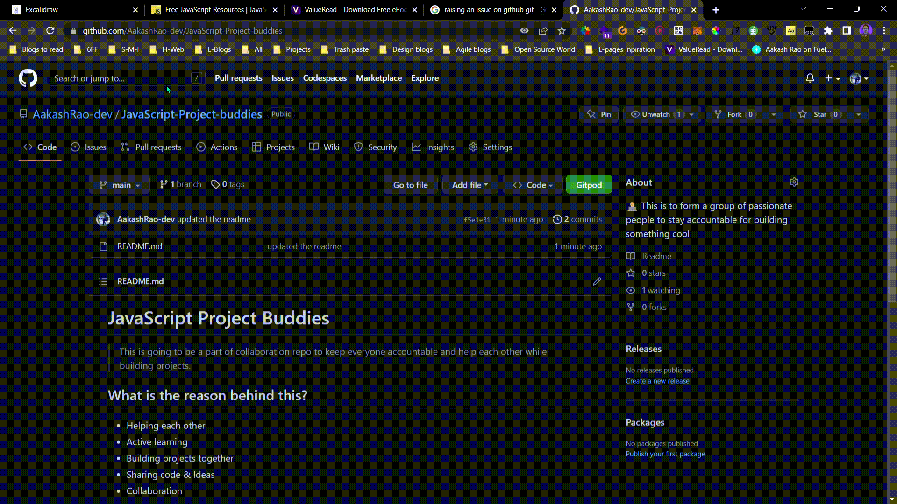

# JavaScript Project Buddies

> This is going to be a part of collaboration repo to keep everyone accountable and help each other while building projects.

## What is the reason behind this?

- Helping each other
- Active learning
- Building projects together
- Sharing code & Ideas
- Collaboration
- Future (Hackathons + Competitions + Building connections)

## What knowledge should I have?

- Just the curosity to learn
- Interested in collaboration

 

# How to take part in this?

- Raise an issue in the issue tab 👇

# Any Doubts?

- Feel free to raise an issue
  - or sending a Discord message
